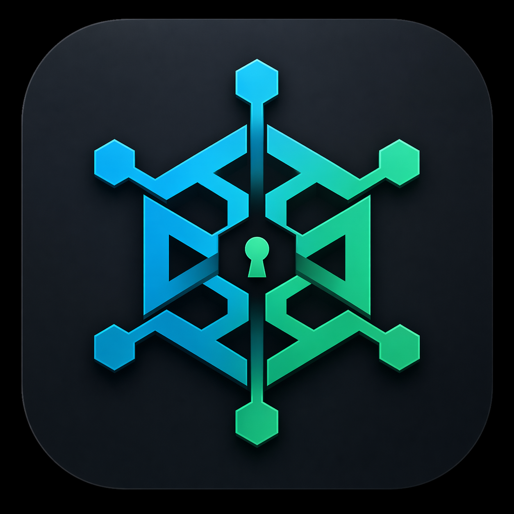

<p align="center">
  
</p>

# Proxnix Manager

This is the supported `Proxnix Manager` GUI. It replaces the retired macOS-only
Swift app with a cross-platform Electrobun app.

Current scope:

- first-run onboarding and site scaffolding
- workstation settings
- site scanning and container bundle management
- shared, group, and container secrets
- git status, staging, commit, and push
- Proxmox API node status
- doctor and publish workflows

## Commands

From this directory:

```bash
bun install
bun run typecheck
```

The usual runtime command is:

```bash
bun start
```

Run the same Manager surface as a local web app:

```bash
bun run web
```

Web mode listens on `127.0.0.1:4173` by default. Expose it to a LAN only behind
a reverse auth proxy:

```bash
bun run web -- --host 0.0.0.0 --port 4173
```

Set `PROXNIX_MANAGER_TRUSTED_AUTH_HEADER` to the identity header your trusted
proxy injects, for example `X-Forwarded-User`. Proxnix Manager does not
implement first-party login in web mode; use an auth proxy such as Authentik,
Authelia, oauth2-proxy, Cloudflare Access, or Tailscale in front of it.

The dev bridge prefers the repo-local workstation virtualenv, so prepare it
before testing secret providers:

```bash
../../ci/bootstrap-workstation-venv.sh
../.venv/bin/python -m pip install pykeepass
```

Use a disposable config home to test onboarding without touching your real
workstation config:

```bash
XDG_CONFIG_HOME=/tmp/proxnix-onboarding-config bun start
```

## Layout

```text
app/
  desktop/
    index.ts
  shared/
    capabilities/
      managerHandlers.ts
      proxmoxBridge.ts
      pythonBridge.ts
      workstationBridge.ts
      scripts/proxnix_bridge.py
    frontend/
      desktop.ts
      desktopRpcClient.ts
      icons.ts
      index.ts
      index.html
      index.css
      rpcTypes.ts
      web.ts
      webRpcClient.ts
    types/
      proxmoxTypes.ts
      types.ts
  webui/
    index.ts
```

The deployment boundaries are intentionally separate:

- `app/desktop/` is the local Electrobun host: native window, file picker,
  open-path/editor integrations, and RPC wiring into shared capabilities.
- `app/shared/` contains reusable code used by both hosts: browser UI,
  RPC client contracts, Manager capabilities, Python bridge, Proxmox bridge,
  and shared request/response types.
- `app/shared/frontend/index.ts` contains the browser UI and only depends on an
  injected RPC client. `desktop.ts` is the Electrobun view entrypoint, while
  `web.ts` is the HTTP web entrypoint.
- `app/webui/` is the hosted Bun HTTP server: static frontend serving plus
  `/api/rpc` wiring into the same shared capabilities.

## macOS signing

Release builds can be Developer ID signed and notarized by setting:

```bash
PROXNIX_MANAGER_MACOS_CODESIGN=1
PROXNIX_MANAGER_MACOS_NOTARIZE=1
ELECTROBUN_DEVELOPER_ID="Developer ID Application: ..."
ELECTROBUN_TEAMID="..."
ELECTROBUN_APPLEID="..."
ELECTROBUN_APPLEIDPASS="..."
```

Unsigned local builds are ad-hoc signed by default so macOS can usually put
them on the Privacy & Security "Open Anyway" path. They may still need
quarantine removed before macOS will open them:

```bash
xattr -dr com.apple.quarantine "/Applications/Proxnix Manager.app"
```

Set `PROXNIX_MANAGER_MACOS_ADHOC_SIGN=0` to disable the ad-hoc fallback.

## Bridge design

The app is CLI-first from the UI boundary. Bun invokes a Python bridge process
by subprocess and receives JSON envelopes; it does not import workstation
Python internals directly. The bridge can:

- read and write `~/.config/proxnix/config`
- preserve unknown `PROXNIX_*` assignments
- scan the site repo for containers, drop-ins, secret groups, and identities
- call the workstation Python package for secrets, doctor, and publish actions

Proxmox API integration is a separate Bun-side capability module, exposed
through the same Manager RPC surface as the workstation bridge. Enable it in
Settings to show the Proxmox page and container restart/status actions. The
saved config keys are:

```bash
PROXNIX_PROXMOX_API_ENABLED='true'
PROXNIX_PROXMOX_API_URL='https://proxmox.example:8006'
PROXNIX_PROXMOX_API_TOKEN_ID='root@pam!proxnix-manager'
PROXNIX_PROXMOX_API_TOKEN_SECRET='...'
PROXNIX_PROXMOX_VERIFY_TLS='false'
```

When `PROXNIX_PROXMOX_API_ENABLED` is unset or false, the Manager hides Proxmox
views/actions and does not make Proxmox API requests.

`PROXNIX_PROXMOX_VERIFY_TLS=false` is useful for local clusters with
self-signed certificates. It defaults to strict TLS verification.

Python resolution order:

1. `PROXNIX_MANAGER_PYTHON`
2. packaged `bin/proxnix-python` under the app resources directory
3. repo-local `workstation/.venv/bin/python`
4. Homebrew `python`
5. `python3`, `python`, or `py -3`

Packaged builds bundle the workstation source and core Python dependencies
under the app resources directory. Optional provider packages such as
`pykeepass` are not bundled.

Set `PROXNIX_MANAGER_PYTHONPATH` in the app settings or process environment to
add extra import paths for Manager-only Python integrations. The value uses the
platform `PYTHONPATH` separator and is applied to the bridge plus CLI
subprocesses launched by the bridge. Prefer `site-packages` paths; venv `bin`
paths and venv Python executables are expanded automatically.
